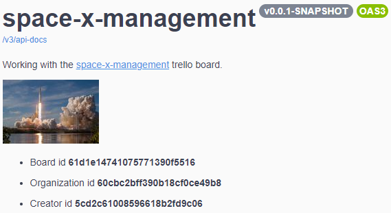

# space-x-management

Solution for [The Space-x Challenge](https://doc.clickup.com/p/h/e12h-16043/f3e54f9ffd37f57).

- [space-x-management](#space-x-management)
- [Pre requirements](#pre-requirements)
- [Starting the app](#starting-the-app)
- [Available features](#available-features)

# Pre requirements
- Java 8 or Better.
- A [Trello Board](trello.com) with both a [board api-key and user-token](https://trello.com/app-key).
  
# Starting the app
Make sure all the required environment variables are loaded:

| env-var name | usage |
| - | - |
| `trello.key` | Trello board api-key |
| `trello.token` | Trello user token |
| `trello.work-board.id` or `trello.work-board.name` | The Trello board the app will work with |

Once those are set launch the following command at the root of this project:

```
mvnw spring-boot:run
```

If you followed the steps after a few seconds you should see
```
2022-01-02 16:51:05.147  INFO 30868 --- [  restartedMain] o.s.b.web.embedded.netty.NettyWebServer  : Netty started on port 8080
2022-01-02 16:51:05.155  INFO 30868 --- [  restartedMain] c.f.s.SpaceXManagementApplication        : Started SpaceXManagementApplication in 3.139 seconds (JVM running for 3.469)
```

in the terminal output, that means the app started successfully. You can further check the app running by opening a browser at http://localhost:8080/swagger-ui.html to check the OpenApi endpoints documentation and the configured Trello Working Board:



# Available features